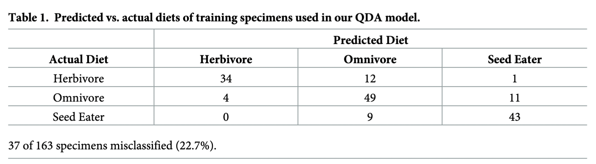
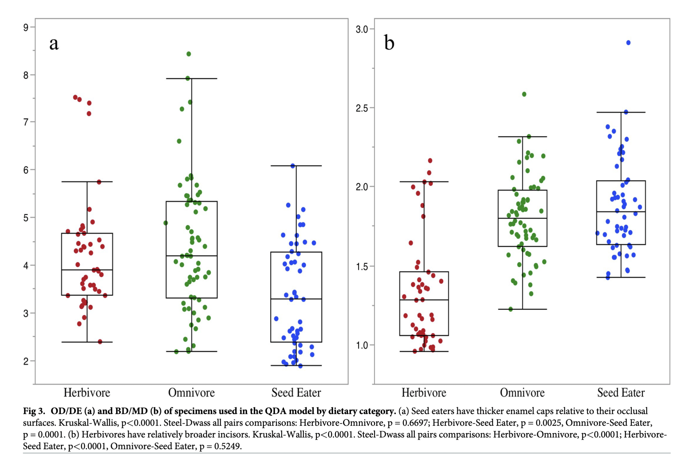

# Introduction

This project replicates some of the analyses done by [Paine et al. (2019)](https://journals.plos.org/plosone/article?id=10.1371/journal.pone.0205476#sec009) in "The ecomorphology of southern African rodent incisors: Potential applications to the hominin fossil record." The goal of this study was to identify if metric characteristics of rodent incisors corresonded with diet. 

Paine et al. took 6 different measurements from the upper incisors of 41 rodent species from South Africa: **buccolingual diameter, or BD** (the width of the incisor from a lateral view), **mesiodistal diameter, or MD** (the width of the incisor from an anterior view), **distal enamel extent, or DE** (the width of the enamel on the incisor as marked by an orange color, from a lateral view), **buccolingual occlusal diameter, or OD** (the length of the occlusal surface of the incisor), **radius of curvature, or RC** (the radius of the circle created by extending the curve of the incisor into a full circle), and **occlusal angle, OA** (the angle created by the occlusal surface of the incisor and the radius of curvature). Blomberg's *K*, which measures phylogenetic signal under Brownian motion, was calculated for each of the 6 metric characteristics, and for ratios calculated using all possible combinations of the 6 measures. Morphological measures with a *K* value less than 1 were considered to be under selective pressure rather than the result of phylogenetic constraints. 

Of the 14 measures that produced *K* values < 1, 4 were used in a stepwise quadratic discriminant analysis as predictor variables to classify dietary category (herbivore, omnivore, or seed predators). The resulting model correctly predicted a rodent's diet in 77.3% of the study sample based on four ratio measurements. Canonical plots of the QDA visualize the separation between the three rodent diets in graphical space.   

Implications for the study of hominin paleoecology follow from the results of this research. If diet can be predicted for rodent incisors present in faunal assemblages at paleoanehtopological sites, then inferences may be made about what foraging behaviors were supported by the local environments. 

# Preparing the Data 

Loading all necessary packages:  

```{r message=FALSE}
library(tidyverse)
library(knitr)
library(klaR)
library(kableExtra)
library(MASS)
library(ggpubr)
```

Loading the study data set: measurements for the 6 metric characteristics for 163 rodent specimens (41 total genera).

```{r message=FALSE}
f <- "https://raw.githubusercontent.com/clairebran/data-analysis-replication/main/data/Paine_2019_data.csv"
d <- read_csv(f, col_names = TRUE)
```

Taking a look at the data set:

```{r echo=FALSE, results='asis'}
kable(d) %>%
  kable_styling(bootstrap_options = "striped") %>%
  scroll_box(height = "200px")
```


In the Paine et al. (2019) paper, all possible ratio measurements were calculated from the raw metric characteristics to total 36 measurements for each rodent species. To replicate their analyses, I am only interested in the characteristics for which the *K* statistic is < 1. 

Here, I add those ratios (*K* < 1) to the data set, and winnow the data set to only include those variables. 

```{r}
d <- d %>% mutate(
  OD_MD = OD/MD,
  MD_OD = MD/OD,
  OA_DE = OA/DE,
  OA_BD = OA/BD,
  OA_MD = OA/MD,
  OD_DE = OD/DE,
  OD_RC = OD/RC,
  MD_RC = MD/RC,
  BD_MD = BD/MD,
  BD_DE = BD/DE,
  RC_MD = RC/MD,
  MD_DE = MD/DE,
  DE_MD = DE/MD,
  RC_OD = RC/OD
) %>% dplyr::select(
  `Dietary Category`,
  OD_MD,
  MD_OD,
  OA_DE,
  OA_BD,
  OA_MD,
  OD_DE,
  OD_RC,
  MD_RC,
  BD_MD,
  BD_DE,
  RC_MD,
  MD_DE,
  DE_MD,
  RC_OD
) %>% rename(diet = `Dietary Category`) 

d$diet <- as.factor(d$diet)
```

# Quadratic Discriminant Analysis

#### Inferential Statistics: Performing QDA

Fitting QDA model to the rodent diets using four variables specific by Pain et al. (2019). 

```{r}
qda_model <- qda(diet ~ OA_MD + OD_DE + BD_MD + RC_MD, data = d) 
```

Predicting the diets of the rodents using the QDA model:

```{r}
predicted <- predict(qda_model, d) 

predict_class <- predicted$class # creating an object with only the class variables from the prediction 

per_correct <- mean(predict_class==d$diet) # calculating the percentage of dietary categories that were correctly classified 

per_incorrect <- 1-per_correct # calculating the percentage of dietary categories that were incorrectly classified 
```

#### Descriptive Statistics: Comparing my results with that of Pain et al. (2019)

**My results:**

```{r echo=FALSE}
table1 <- table(predict_class, d$diet)

kbl(table1, caption = "Table 1. Predicted vs. actual diets of specimens used in my QDA model") %>%
  kable_classic() %>%
    footnote(general = "35 of 163 specimens misclassified (21%)") %>%
  add_header_above(c(" " = 1, "Predicted Diet" = 3))
```


**Results from Paine et al. (2019):**

```{r echo=FALSE}

```


In comparing my QDA with that of Paine et al (2019), our results, looking at both the tables displaying the predicted vs. actual diets of specimens and the percentages of specimens that were misclassified, were very similar but not exactly the same. It seems that Paine et al. split their original data set of 163 specimens into training and test data sets when developing their QDA model, but they do not specify in their manuscipt what percentage or amount of specimens were allocated to each. I think this may be causing the discrepencies between our results, due to the fact that I did not split my data into training and test sets. 

Paine et al. also performed a *stepwise* QDA analysis, which I was not able to figure out how to recreate. I believe I would need to use the stepclass() function as part of the {klaR} package, but my efforts to do so were not successful.  

# Data Visualization 

A recreation of Figure 3 from the Paine et al. paper which shows boxplots of OD/DE and BD/MD for each dietary category for specimens used in the QDA model. Paine et al. use this data visualization to explain that "seed eaters have buccolingually deep incisors with a relatively thick enamel cap whereas herbivore incisors are mesiodistally broad and thin; this may be a result of "the mechanical challenges posed by [different] food items." 

Creating the boxplots:

```{r}
OD_DE_plot <- d %>%
  ggplot(aes(x = diet, y = OD_DE)) +
  stat_boxplot(geom = "errorbar") +
  geom_boxplot() +
  geom_jitter(aes(colour = diet)) +
  theme_classic() +
  xlab("Dietary Category") + ylab("OD/DE") + 
  theme(legend.position = "none")

BD_MD_plot <- d %>%
  ggplot(aes(x = diet, y = BD_MD)) +
  stat_boxplot(geom = "errorbar") +
  geom_boxplot() +
  geom_jitter(aes(colour = diet)) +
  theme_classic() +
  xlab("Dietary Category") + ylab("OD/DE") + 
  theme(legend.position = "none")
```

**My recreation of the data visualization:**

```{r}
ggarrange(OD_DE_plot, BD_MD_plot)
```

**Boxplots from the Paine et al. paper:**

```{r echo=FALSE}

```


# Summary and Discussion 

Overall, the replications of the data analysis and visualizations were successful. The model I created with a quadratic discriminant analysis (QDA) produced results *almost* identical to those seen in the paper. Where my model correctly predicted rodent diets based on four measures of incisor morphology 79% of the time, the authors' model correctly predicted diets only 77.3% of the time. The largest sources of error were that my model misclassified 9 omnivores as herbivores while Paine et al.'s misclassified only 4, and my model only misclassified 4 herbivores as omnivores, Paine et al.'s misclassified 12. As I discussed earlier in this report, I believe this to be a result of the fact that the authors allocated some of their data to training and test data sets, but did not specify how they did so. However, it is unclear to me why I see such a discrepency in these two classifications as opposed to others where the values I obtained were identical or were nearly identical to those of Paine et al. Even though I would classify this replication as a success, the boxplots I produced to emulate those in the paper were even more successful, with no huge differences between our plots. Of course, creating a boxplot is a much more simple analysis than a QDA.  

Through working on this assignment, I really learned just how hard it can be to replicate research findings that are not your own. In truth, I attempted to recreate two additional analyses from the Paine et al. paper: the calculation of the *K* statistic to determine phylogenetic signal from incisor morphological characteristics, *and* the canonical plots derived from the quadratic discriminant analysis. Paine et al. specified that they used the phylogeny developed by [Faurby & Svenning (2015)](https://www.sciencedirect.com/science/article/pii/S1055790314003844#s0095), though their protocols for actually creating the phylogeny in R, or any other programming software, for that matter, were not provided. Faurby and Svenning provide individual phylogenies for the families of rodents which need to be merged in order to create a phylogeny for Rodentia as a whole, making the initial task of reading the phylogenies into R a challenge. Furthermore, the rodent phylogenies provided seemingly do not include one for Pedetidae, a family of rodents of which there are four individual specimens in Paine et al.'s sample. It was unclear to me how this was resolved when determining *K* statistics for the specimens in this taxon. If the *K* values calculated by Paine et al. had not been provided in their supplemental data, developing much of this report would have posed a major challenge, and one I'm not sure I, or any other researcher with little experience working with phylogenetic data in R, would have been equipped to handle! 

My attempt to recreate the canonical plots derived from the QDA analysis also proved unfruitful as the exact analysis employed to create Paine et al.'s second figure was unclear. My attempts to research "canonical plots of quadratic discriminant analyses" yielded a handful of papers with similar figures/analyses of QDA results visualized in canonical space (e.g., [Fuller et al., 2024](https://www.researchgate.net/figure/Canonical-plot-from-quadratic-discriminant-analysis-of-all-samples-Points-indicate_fig1_379283559) and [Ferrenberg et al., 2019](https://www.researchgate.net/figure/Canonical-plots-illustrating-quadratic-discriminant-analyses-QDA-of-multivariate_fig2_335058272)), yet none went into more detail than Paine et al did. All of my attempts to calculate canonical scores from the results of my QDA resulted in error messages. 

My takeaway from this assignment is that sharing data and code is crucial during the publication process if authors want others to be able to replicate their analyses, something we should all strive for to uphold replication and reproducibility as two of the most important tenets of the scientific process.  

# References 

Faurby, S., & Svenning, J. (2015). A species-level phylogeny of all extant and late Quaternary extinct mammals using a novel heuristic-hierarchical Bayesial approach. *Molecular Phylogenetics and Evolution, 84*, 14-26. 

Ferrenberg, S., Wickey, P., & Coop, J. D. (2019). Ground-dwelling arthropod community responses to recent and repeated wildfires in conifer forests of northern New Mexico, USA. *Forests, 10*(8), 667. 

Fuller, K., Martin, R. E., & Asner, G. P. (2024). Spectral signatures of macroalgae on Hawaiian reefs. *Remote Sensing, 16*(7), 1140. 

Paine, O. C., Leichliter, J. N., Avenant, N., Codron, D., Lawrence, A., & Sponheimer, M. (2019). The ecomorphology of southern African rodent incisors: Potential applications to the hominin fossil record. *Plos One, 14*(2), e0205476. 

